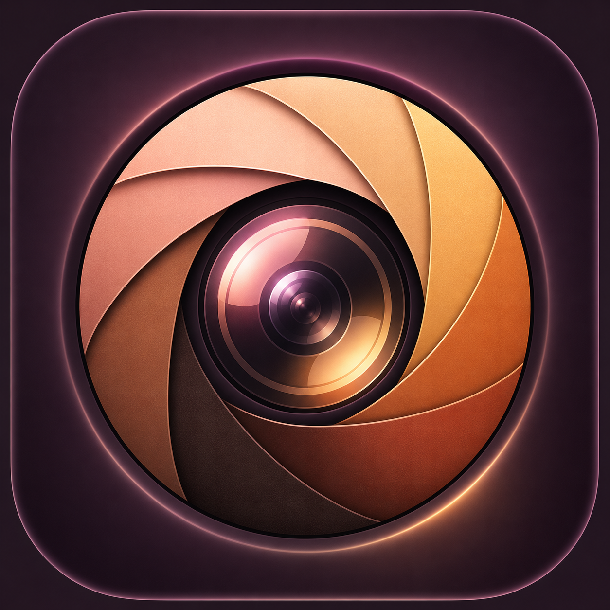

# Skin Tone Studio for macOS



**Fine-tune your webcam so your natural skin tone is captured accurately—and let the real you shine.**

Not every webcam sees every complexion accurately. Skin Tone Studio is an uplifting, privacy-first macOS camera controller that helps people across the full range of skin tones correct color casts, preserve natural warmth, lock focus, and look like themselves on camera.

## What it does

- Shows the webcam's low-latency live hardware output—the same image other camera apps receive.
- Starts from Light, Medium, Tan, or Deep color guidance without changing skin brightness.
- Fine-tunes skin warmth, rosiness, global temperature/tint, exposure, contrast, saturation, and vibrance.
- Detects UVC capabilities instead of showing controls that a camera cannot use.
- Locks autofocus and provides a manual near/far focus slider on supported USB webcams.
- Supports UVC Off/50 Hz/60 Hz/Auto powerline modes.
- Adds 45–65 Hz precision LED tuning by pairing the closest powerline mode with a flicker-safe manual exposure on cameras that expose both controls.
- Applies white balance, hue, saturation, brightness, and contrast directly to camera hardware as sliders move.
- Saves named profiles containing color, focus, and anti-flicker settings.
- Stays available in the macOS menu bar when its window is minimized or closed.
- Restores the webcam's UVC factory defaults with Camera Reset.

## Build and run

macOS 14 or newer and Apple's Command Line Tools are required. The app is built against the currently selected macOS SDK.

```sh
chmod +x scripts/build-app.sh
./scripts/build-app.sh
open "dist/Skin Tone Studio.app"
```

Run the lightweight checks (no full Xcode test runtime required):

```sh
swift run SkinToneChecks
```

With a USB webcam attached, report its UVC capabilities without changing them:

```sh
swift run SkinToneChecks --hardware
```

Verify live UVC writes by writing supported controls' current values back unchanged:

```sh
swift run SkinToneChecks --hardware --hardware-write
```

## Important behavior

Hardware UVC changes are made continuously and remain active when Zoom, Teams, FaceTime, or another app opens the physical webcam. There is no separate preview look and no Apply or Send step.

Built-in Mac cameras, Continuity Camera, and some vendor-specific cameras may not expose UVC controls. The UI explains when direct hardware control is unavailable.

## Privacy

Frames are processed locally with Core Image. The app has no networking or analytics code and does not record video.

## License

GPL-3.0. The UVC foundation is derived from CameraController; see `NOTICE.md`.
